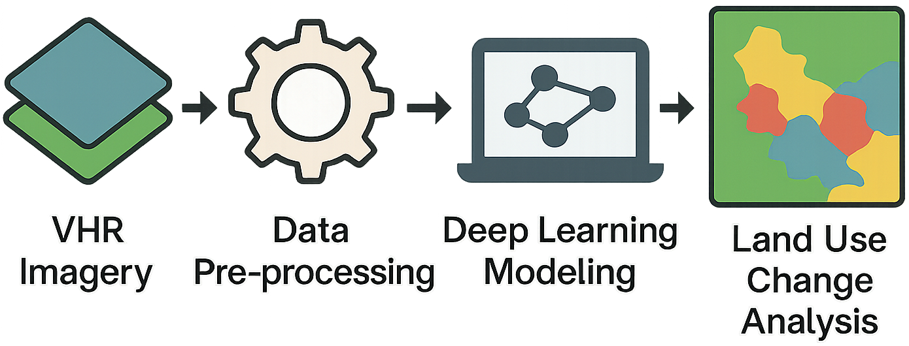

.. Ethiopia LCLUC documentation master file, created by
   sphinx-quickstart on Mon Mar 31 14:18:27 2025.
   You can adapt this file completely to your liking, but it should at least
   contain the root `toctree` directive.

Ethiopia LCLUC Documentation
============================

**Machine learning-powered LCLUC analysis for Ethiopia using WorldView imagery**

Welcome to the documentation for the Ethiopia LCLUC project.  
This library has been developed by the NASA GSFC Data Science Group (606.3) to serve as a unified, Python-based framework for processing very high resolution (VHR) remote sensing imagery. Focused on Ethiopia, this toolkit supports land cover land use change (LCLUC) analysis using WorldView imagery.

The framework supports end-to-end workflows for compositing and validating land cover classification results derived from a range of machine learning models—including Random Forest, XGBoost, and convolutional neural networks (CNNs). These tools generate consistent, multi-year land cover composites from large-scale VHR imagery.

.. note::
   This project remains under active development.

Repository Features
--------------------

This library enables:

- **Preprocessing** of WorldView imagery  
- **Model training and inference** with ML/DL algorithms  
- **Land cover prediction** using multiple classification models  
- **Compositing** of results to create annual or multi-year representations  

**Pipelines:**

- **Land Cover Pipeline** – Produces GeoTIFF predictions from trained models  
- **Compositing Pipeline** – Aggregates predictions to generate validated land cover composites  

Contents
--------

.. toctree::
   :maxdepth: 1
   :caption: Project Overview

   context/introduction
   context/workflows

.. toctree::
   :maxdepth: 1
   :caption: Tutorials

   tutorials/quickstart
   tutorials/composite
   tutorials/qgis
   tutorials/troubleshoot

.. toctree::
   :maxdepth: 1
   :caption: Module Documentation

   reference/landcover_pipeline
   reference/landcover_composite_pipeline

.. toctree::
   :maxdepth: 1
   :caption: Contributing

   contributing

Project Links and Resources
----------------------------

**Organization & Group Resources**

- `NASA GSFC Data Science Group`_: Home of the group contributing to this and other related Earth science data projects.
  - `NASA NCCS HPDA GitHub`_: Collection of open-source software, research code, and tutorials maintained by the NASA GSFC Data Science Group.

**Project Repositories**

- `Ethiopia LCLUC TensorFlow`_: Main repository for this project, including model training code and data processing tools.
- `Very High Resolution (VHR) Composite Tool`_: Repository with tools aimed at generating gridded composite outputs from (VHR) land cover datasets.

**Related Tools**

- `VHR CloudMask GitHub`_: Python library for semantic segmentation of clouds in Very High Resolution (VHR) imagery. See the associated `documentation`_ for usage and contributor details.

.. _NASA GSFC Data Science Group: https://science.gsfc.nasa.gov/cisto/istr/
.. _NASA NCCS HPDA GitHub: https://github.com/nasa-nccs-hpda
.. _Ethiopia LCLUC TensorFlow: https://github.com/nasa-nccs-hpda/ethiopia-lcluc-tensorflow
.. _Very High Resolution (VHR) Composite Tool: https://github.com/nasa-nccs-hpda/vhr-composite
.. _VHR CloudMask GitHub: https://github.com/nasa-nccs-hpda/vhr-cloudmask
.. _documentation: https://nasa-nccs-hpda.github.io/vhr-cloudmask/latest/readme.html

